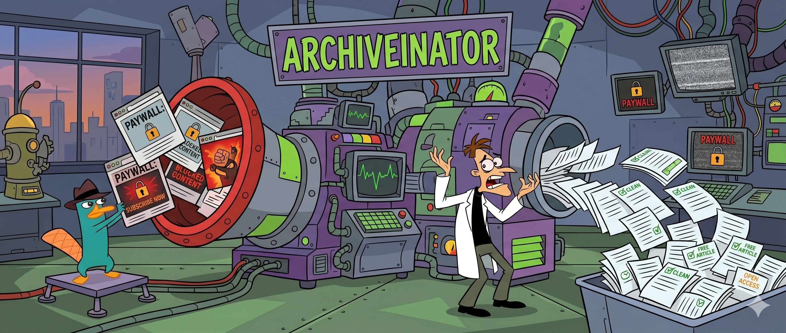

# archiveinator

A local, self-hosted web page archiver with ad blocking and paywall bypass.

archiveinator saves web pages as self-contained single-file HTML documents you can open offline forever — no external dependencies, no external services, full control over your archives.

---

## Choose Your Path

<h3 style="color: #3b82f6; margin-top: 0;">⌨️ CLI User</h3>

Archive pages from the command line with full pipeline control, cookie authentication, and paywall bypass.

<a href="cli-reference">CLI Reference →</a>

<h3 style="color: #22c55e; margin-top: 0;">🌐 Web UI User</h3>

Archive pages, manage site profiles, monitor RSS feeds, and schedule recurring archives — all from your browser.

<a href="web-ui/">Web UI Guide →</a>

<h3 style="color: #9333ea; margin-top: 0;">🐳 Docker User</h3>

Run archiveinator in a container — no Python setup needed. Ships with Chromium, monolith, and blocklists pre-installed.

<a href="docker">Docker Guide →</a>

---

## Quick Links

| Topic | Description |
|:------|:------------|
| [Getting Started](getting-started) | Prerequisites, installation, first-time setup, and your first archive |
| [CLI Reference](cli-reference) | All CLI commands with option tables and examples |
| [Configuration](configuration) | Full `config.yaml` reference — pipeline, UAs, timeouts, and more |
| [Pipeline](pipeline) | All 17 pipeline steps explained, with their order and default state |
| [Paywall Bypass](paywall-bypass) | Detection logic, bypass trigger conditions, and the 10 bypass strategies |
| [Web UI](web-ui/) | Browser-based interface for archiving, profiles, RSS feeds, schedules, and bulk imports |
| [Docker](docker) | Running archiveinator in a container — pull, run, volumes, and scripting |
| [Development](development) | Dev setup, project structure, testing, CI, and release process |

---

## How archiveinator Works

1. **Enter a URL** — from the CLI, web UI, or a scheduled cron job
2. **Pipeline processes the page** — network-level ad blocking, headless Chromium page load, paywall detection and bypass, DOM cleanup, image deduplication
3. **Get a self-contained HTML archive** — all assets inlined into a single file, viewable offline forever
